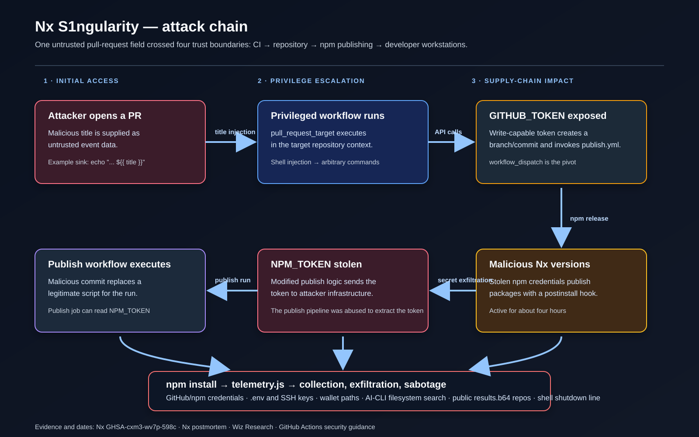
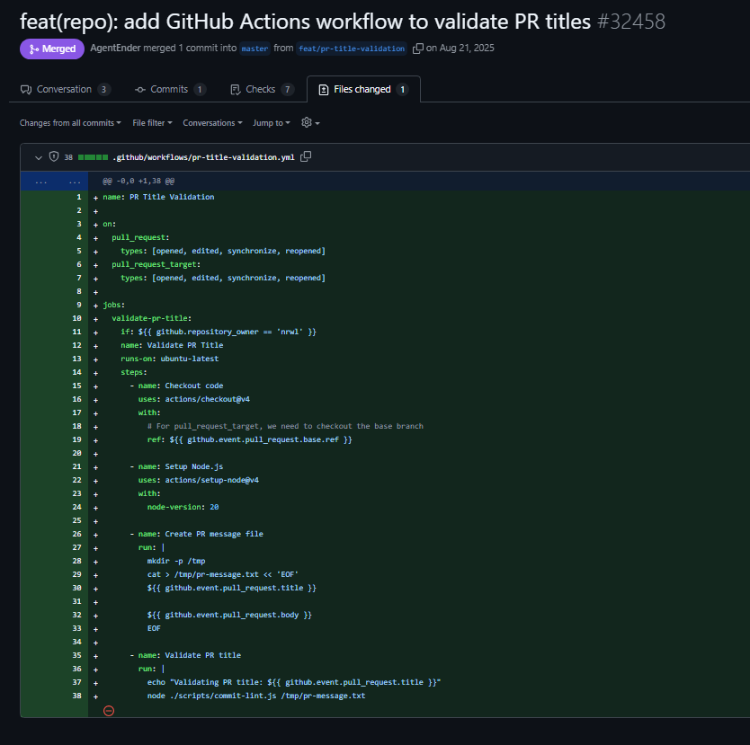
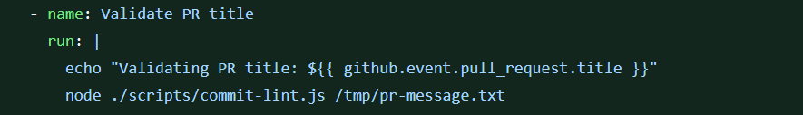
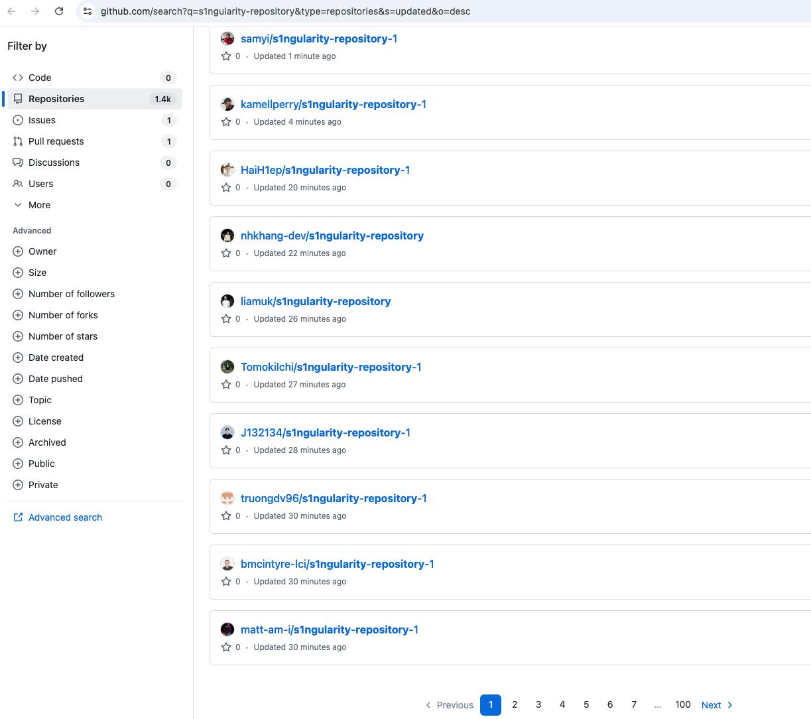
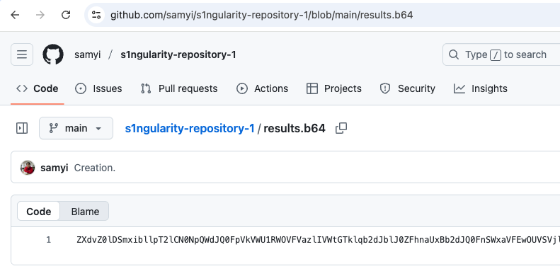
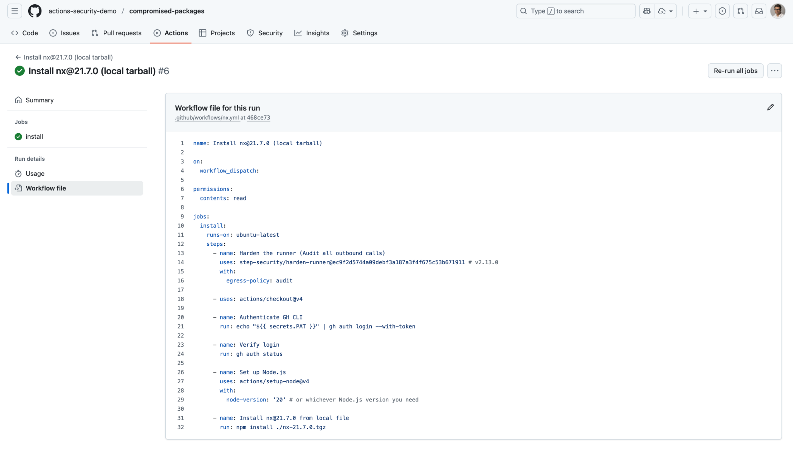

# Nx S1ngularity: from CI injection to npm supply-chain compromise

> **Incident window:** August 21–26, 2025  
> **Primary weakness:** shell injection in a `pull_request_target` GitHub Actions workflow  
> **Impact:** malicious Nx packages were published to npm and ran an install-time data-stealing payload on Linux and macOS systems

## Executive summary

S1ngularity was not a single isolated bug. It was a chain of trust-boundary failures:

1. A pull-request title controlled by an attacker was interpolated directly into a Bash `run:` block.
2. The workflow also listened to `pull_request_target`, so the job ran in the Nx repository’s security context.
3. The resulting command injection exposed a write-capable `GITHUB_TOKEN`.
4. That token was used to create attacker-controlled repository content and invoke the release workflow through `workflow_dispatch`.
5. The release workflow exposed `NPM_TOKEN`, which was sent to attacker-controlled infrastructure.
6. The stolen npm credential was used to publish malicious Nx versions.
7. An `npm install` of an affected version executed `telemetry.js`, which harvested credentials and file paths, attempted to use installed AI CLIs for filesystem reconnaissance, uploaded encoded results to public GitHub repositories, and modified shell startup files.

Nx’s own advisory confirms the CI injection, the privileged token context, the release-workflow pivot, the npm-token theft, and the install-time payload. The detailed AI-CLI behavior and broader impact were subsequently documented by [Wiz Research](https://www.wiz.io/blog/s1ngularitys-aftermath); [Microsoft’s threat description](https://www.microsoft.com/en-us/wdsi/threats/malware-encyclopedia-description?Name=Trojan%3AJS%2FS1ngularity.A%21MTB) independently summarizes the payload and indicators.



*Figure 1 — The complete chain. The key escalation is from a low-trust PR field to a write-capable repository token, then to the npm publishing credential.*

## 1. Initial access: a PR title becomes shell code

On August 21, 2025, [PR #32458](https://github.com/nrwl/nx/pull/32458) added a workflow to validate pull-request titles. The workflow checked out the base branch and used Nx’s existing `scripts/commit-lint.js` validator. The intended behavior was reasonable: build a temporary commit-message file, print the title, and fail the check if the title did not follow the project’s Conventional Commit format.



*Figure 2 — The workflow introduced by PR #32458. It handled pull-request metadata in a privileged workflow and embedded that metadata in shell commands.*

The dangerous line was:

```yaml
- name: Validate PR title
  run: |
    echo "Validating PR title: ${{ github.event.pull_request.title }}"
    node ./scripts/commit-lint.js /tmp/pr-message.txt
```



*Figure 3 — The vulnerable sink: the GitHub expression is substituted before Bash receives the generated script.*

The pull-request title is attacker-controlled. GitHub Actions expands `${{ github.event.pull_request.title }}` before the runner starts Bash. A title containing shell syntax can therefore change the script that Bash executes. Nx’s advisory gives the representative example `$(echo "You've been compromised")`; in the vulnerable workflow, the command substitution would execute while the title was being printed.

This is a **script-injection** bug, not merely unsafe logging. The safe pattern is to pass untrusted data through an environment variable or an action input so the value is data rather than source code:

```yaml
- name: Validate PR title
  env:
    PR_TITLE: ${{ github.event.pull_request.title }}
  run: |
    printf 'Validating PR title: %s\n' "$PR_TITLE"
    node ./scripts/commit-lint.js /tmp/pr-message.txt
```

GitHub documents this exact mitigation pattern in [Good practices for mitigating script injection attacks](https://docs.github.com/en/actions/reference/security/secure-use#good-practices-for-mitigating-script-injection-attacks).

### A second unsafe input path

The same workflow also placed the PR title and body directly inside a heredoc used to create `/tmp/pr-message.txt`:

```yaml
cat > /tmp/pr-message.txt << 'EOF'
${{ github.event.pull_request.title }}

${{ github.event.pull_request.body }}
EOF
```

The quoted `EOF` delimiter prevents Bash expansion **after** Bash receives the script. It does not stop GitHub from substituting the expressions first. The title echo was the confirmed and sufficient execution sink; the inline heredoc made the overall design harder to reason about and created another place where multiline attacker input was embedded in generated shell source.

## 2. The trust-boundary failure: `pull_request_target`

The workflow listened to both `pull_request` and `pull_request_target`. The latter is the important distinction:

```yaml
on:
  pull_request_target:
    types: [opened, edited, synchronize, reopened]
```

GitHub describes `pull_request_target` as a privileged event. The job receives the base repository’s `GITHUB_TOKEN` and may access repository or organization secrets. A normal fork-based `pull_request` workflow receives a read-only token and does not receive those secrets by default. See [GitHub’s guidance on securely using `pull_request_target`](https://docs.github.com/en/actions/reference/security/securely-using-pull_request_target).

In this incident, the workflow did not need the privilege it received: it was validating metadata, not publishing artifacts or modifying the repository. The repository also retained the older read/write default for Actions permissions. That turned a title-injection bug into repository-level command execution with a write-capable token.

The later investigation found an additional subtlety: reverting the workflow on the default branch was not enough. The malicious PR targeted an older branch that still contained the vulnerable workflow, so that branch remained an executable path until the outdated branches were rebased. The advisory records this as the reason the initial rollback did not categorically close the attack surface.

## 3. Privilege escalation: from `GITHUB_TOKEN` to `NPM_TOKEN`

The first workflow did not directly contain the npm publishing secret. The attacker instead used the injected shell to turn repository write access into a workflow-to-workflow pivot:

1. Use the write-capable `GITHUB_TOKEN` to create a branch containing a malicious change.
2. Replace or alter a script consumed by the publishing workflow.
3. Invoke `publish.yml` through the GitHub API. Its `workflow_dispatch` trigger made programmatic dispatch possible.
4. Remove branches and workflow runs that could reveal the activity.
5. Let the publishing job execute the malicious script, where `NPM_TOKEN` was available.
6. Send the npm token to an attacker-controlled webhook.

This distinction matters: [Nx states that `publish.yml` did not publish the packages during the attack](https://github.com/nrwl/nx/security/advisories/GHSA-cxm3-wv7p-598c); it was abused as the privileged environment from which the npm token could be extracted. The stolen token was then used outside the release pipeline to publish the malicious packages.

## 4. Package poisoning and distribution

On August 26, 2025, malicious versions of `nx` and related packages were published. npm removed the affected versions at 10:44 PM EDT, roughly four hours after the first malicious versions appeared. The official advisory lists the complete affected set:

| Package | Affected versions |
| --- | --- |
| `nx` | `20.9.0`, `20.10.0`, `20.11.0`, `20.12.0`, `21.5.0`, `21.6.0`, `21.7.0`, `21.8.0` |
| `@nx/devkit`, `@nx/js`, `@nx/node`, `@nx/workspace` | `20.9.0`, `21.5.0` |
| `@nx/eslint` | `21.5.0` |
| `@nx/key`, `@nx/enterprise-cloud` | `3.2.0` |

See [GHSA-cxm3-wv7p-598c](https://github.com/nrwl/nx/security/advisories/GHSA-cxm3-wv7p-598c) for the authoritative package and version list.

The malicious package added an install hook. In simplified form, the package metadata exposed a behavior equivalent to:

```json
{
  "scripts": {
    "postinstall": "node telemetry.js"
  }
}
```

That means the payload could run during ordinary package installation, including transitive installs and tooling-driven installs. Nx specifically noted that versions of the Nx Console VS Code extension installed the `latest` Nx package while checking the package version; this caused some users to trigger the hook by launching the editor rather than intentionally adding Nx to a project.

## 5. Install-time payload: `telemetry.js`

The payload targeted Linux and macOS and exited early on Windows:

```js
if (process.platform === 'win32') process.exit(0)
```

### Collection

The script gathered information that was useful for immediate account takeover and follow-on attacks:

| Category | Examples observed in the payload |
| --- | --- |
| Host context | Environment variables, hostname, operating-system and platform details |
| GitHub | `gh auth token` output when the GitHub CLI was installed |
| npm | npm identity and the contents of `~/.npmrc` |
| Developer credentials | `.env` files, SSH private keys such as `id_rsa`, and other configuration files |
| Wallet material | MetaMask, Electrum, Ledger, Trezor, Exodus, Phantom, Solflare, and generic keystore/key patterns |

The malware also searched for local AI assistant CLIs and attempted to make them perform filesystem reconnaissance with safety-reducing flags:

```js
const cliChecks = {
  claude: { cmd: 'claude', args: ['--dangerously-skip-permissions', '-p', PROMPT] },
  gemini: { cmd: 'gemini', args: ['--yolo', '-p', PROMPT] },
  q: { cmd: 'q', args: ['chat', '--trust-all-tools', '--no-interactive', PROMPT] }
};
```

The prompt variants evolved across the malicious releases. The common behavior was to ask the installed assistant to recursively identify sensitive files and write their paths to `/tmp/inventory.txt`. Wiz’s analysis found that this AI-assisted collection was opportunistic rather than universally successful: it required the CLI to be installed and authenticated, the model to accept the task, and the resulting search to identify useful files.

### Exfiltration

When a usable GitHub CLI token was present, the malware attempted to:

1. Create a public repository named `s1ngularity-repository`, with later variants using `s1ngularity-repository-0` or `s1ngularity-repository-1`.
2. Serialize the collected data.
3. Encode it three times with base64.
4. Upload it as `results.b64` through the victim’s own GitHub account.



*Figure 4 — A search view showing the repository naming pattern used for the exfiltration channel. GitHub later removed or restricted many of these repositories, so search results are time-dependent evidence rather than a stable count.*



*Figure 5 — The encoded result file. The repository itself was the attacker’s collection point, while the victim’s GitHub account supplied the API access.*

A representative decoding pipeline is:

```bash
base64 -d results.b64 | base64 -d | base64 -d
```

The public-repository design made the campaign noisy but scalable. [Wiz reported more than 1,700 users with secrets publicly leaked and more than 2,000 unique verified secrets in its analysis](https://www.wiz.io/blog/s1ngularitys-aftermath). Those figures describe Wiz’s observed sample and should not be treated as a complete census of every installation.

### Persistence and sabotage

The payload appended the following line to both `~/.bashrc` and `~/.zshrc`:

```bash
sudo shutdown -h 0
```

On a new terminal session, `sudo` could prompt for the user’s password; if accepted, the machine would shut down. This was a destructive nuisance and a useful indicator of compromise, not the primary data-theft mechanism.

## 6. Detection and incident response

The most useful indicators are behavioral, because package versions and leaked repositories may no longer be available:

- An affected Nx version in a lockfile, npm cache, `node_modules`, or install log.
- Unexpected `repo.create` events containing `s1ngularity` in GitHub audit logs.
- Public repositories named `s1ngularity-repository`, `s1ngularity-repository-0`, or `s1ngularity-repository-1`.
- Unexpected GitHub API activity during `npm install`, especially from `gh` or `api.github.com`.
- `/tmp/inventory.txt` or `/tmp/inventory.txt.bak`.
- `sudo shutdown -h 0` appended to `~/.bashrc` or `~/.zshrc`.
- Unexpected use of Claude, Gemini, or Amazon Q from an npm installation process.



*Figure 6 — A lab capture using Harden Runner to make outbound activity visible during an Nx installation test. Egress monitoring is useful because a normal package install should not need to create GitHub repositories or call arbitrary external endpoints.*

If an affected version was installed, treat credentials available to that process as exposed:

1. Disconnect or isolate the machine and preserve relevant logs.
2. Remove the affected package and reinstall from a known-good lockfile and version.
3. Revoke and rotate GitHub tokens, npm tokens, SSH keys, cloud credentials, `.env` secrets, and wallet material that was present on the host.
4. Review GitHub security and audit logs for repository creation, token use, repository visibility changes, and unexpected API calls.
5. Inspect and clean shell startup files and temporary inventory files.
6. Check developer machines, CI runners, editor extensions, caches, and transitive dependencies—not just the top-level `package.json`.

Nx’s [incident guidance](https://nx.dev/blog/s1ngularity-postmortem) and [security advisory](https://github.com/nrwl/nx/security/advisories/GHSA-cxm3-wv7p-598c) provide the incident-specific response steps.

## 7. Lessons for CI/CD and package publishing

### Keep untrusted input out of generated shell source

- Never interpolate PR titles, bodies, branch names, commit messages, issue text, labels, or comments directly into `run:` scripts.
- Pass values through `env:` and quote shell variables, or use an action that accepts the value as an input.
- Prefer a parser or action over handwritten shell when validating structured metadata.

### Separate untrusted PR processing from privileged automation

- Use `pull_request` when the job does not need secrets or write access.
- Use `pull_request_target` only for narrowly scoped metadata operations, with explicit least-privilege permissions.
- Do not check out, build, test, install, or otherwise execute code from an untrusted PR in a privileged workflow.
- Protect `workflow_dispatch` and other workflow triggers from becoming an API-based privilege-escalation path.

GitHub’s [secure-use reference](https://docs.github.com/en/actions/reference/security/secure-use) explicitly warns that privileged triggers combined with untrusted code or data can expose repository write access and secrets.

### Make publishing resistant to token theft

- Set workflow permissions explicitly, for example `contents: read`, and grant write access only to the job that needs it.
- Require independent approval for releases and environment secrets.
- Pin third-party Actions to full commit SHAs and review workflow changes under code ownership.
- Prefer short-lived OIDC-based publishing over long-lived npm tokens. Nx moved to [npm Trusted Publishers](https://docs.npmjs.com/trusted-publishers) after the incident.
- Monitor outbound network activity from CI and fail or quarantine unexpected credential and repository operations.
- Treat package install hooks as code execution and run them in isolated, ephemeral environments where possible.

## Timeline

All times below are Eastern Daylight Time and come from the [Nx security advisory](https://github.com/nrwl/nx/security/advisories/GHSA-cxm3-wv7p-598c).

| Date and time | Event |
| --- | --- |
| Aug 21, 2025 · 4:31 PM | PR #32458 merged, introducing the vulnerable title-validation workflow. |
| Aug 22 · 3:45 PM | The workflow was reverted after public discussion, but stale target branches could still invoke it. |
| Aug 24 · 4:50 PM | A malicious commit containing behavior consistent with npm-token theft appeared in the Nx repository. |
| Aug 24 · 5:04 PM | Audit logs later showed a malicious PR using a title that triggered the injection. |
| Aug 24 · 5:11 PM | Audit logs later showed the publishing workflow being deleted after use of the malicious commit. |
| Aug 26 · 6:32 PM | First malicious Nx and related package versions published. |
| Aug 26 · 6:37–10:44 PM | Malicious versions were tagged as `latest` and remained available until npm removed them. |
| Aug 27 · 1:53 AM | Nx published the security advisory. |
| Aug 27 · 11:57 AM | Nx packages were moved to npm Trusted Publishers and required 2FA for publishing. |

## References

- [Nx GHSA-cxm3-wv7p-598c: Malicious versions of Nx and supporting plugins](https://github.com/nrwl/nx/security/advisories/GHSA-cxm3-wv7p-598c) — primary advisory, affected versions, attack timeline, and remediation.
- [Nx postmortem: S1ngularity — What Happened, How We Responded, What We Learned](https://nx.dev/blog/s1ngularity-postmortem) — attack-chain summary, impact, and changes to the release process.
- [PR #32458](https://github.com/nrwl/nx/pull/32458) — introduction of the PR title-validation workflow.
- [GitHub: Securely using `pull_request_target`](https://docs.github.com/en/actions/reference/security/securely-using-pull_request_target) — privilege model and untrusted-code risks.
- [GitHub: Secure use reference](https://docs.github.com/en/actions/reference/security/secure-use) — script-injection mitigations and workflow hardening guidance.
- [Wiz Research: S1ngularity’s aftermath](https://www.wiz.io/blog/s1ngularitys-aftermath) — AI-CLI behavior, exfiltration variants, and observed impact.
- [Microsoft Security Intelligence: Trojan:JS/S1ngularity](https://www.microsoft.com/en-us/wdsi/threats/malware-encyclopedia-description?Name=Trojan%3AJS%2FS1ngularity.A%21MTB) — independent payload summary and indicators.
- [StepSecurity: Nx build-system compromise](https://www.stepsecurity.io/blog/supply-chain-security-alert-popular-nx-build-system-package-compromised-with-data-stealing-malware) — runner telemetry and supply-chain analysis.
- [Aikido: S1ngularity Nx attack](https://www.aikido.dev/blog/s1ngularity-nx-attackers-strike-again) — additional package and malware analysis.
- [npm Trusted Publishers](https://docs.npmjs.com/trusted-publishers) — OIDC-based publishing model adopted after the incident.
